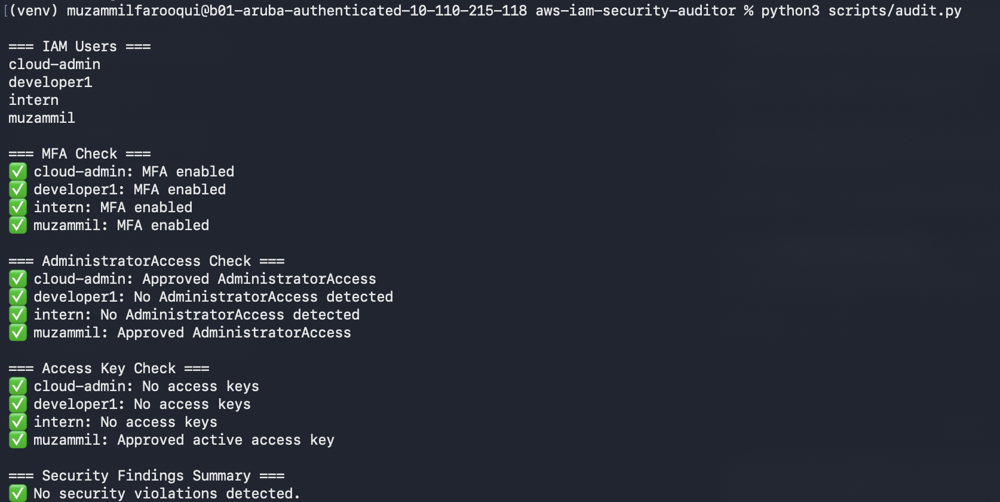
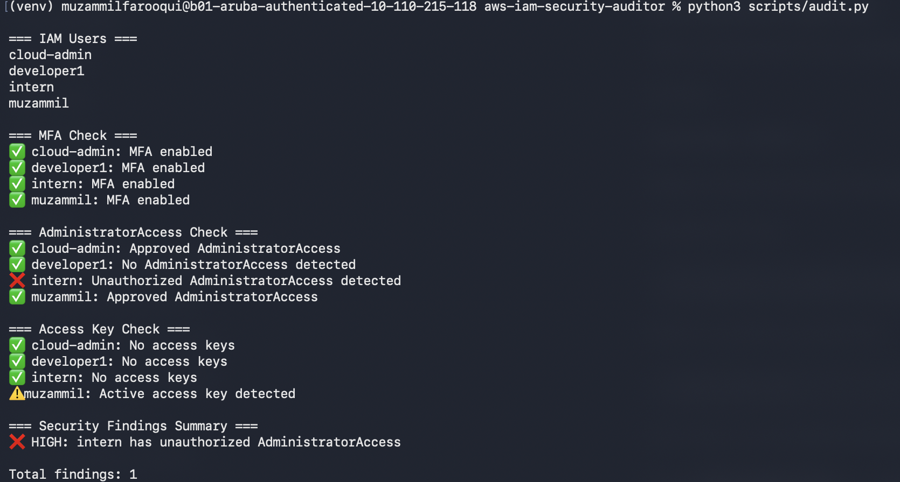
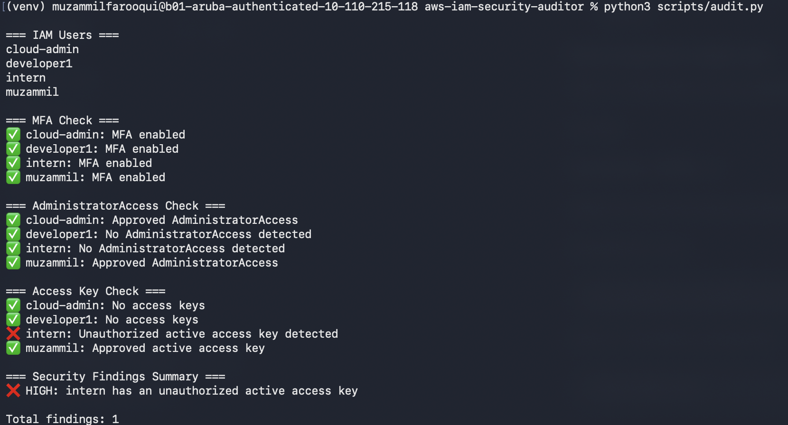
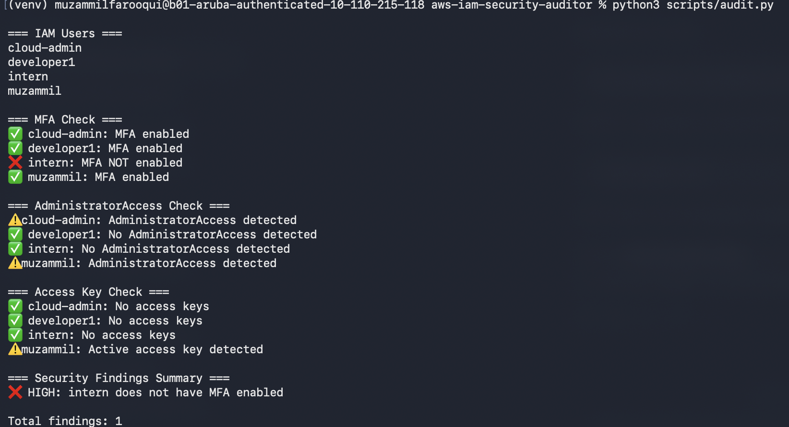

# AWS IAM Security Auditor

## Overview

AWS IAM Security Auditor is a cloud security project that simulates a real-world AWS Identity and Access Management (IAM) security assessment.

The project began with a manually configured AWS environment containing intentional IAM security misconfigurations. The environment was manually audited to identify security risks, document evidence, assess severity, recommend remediation, and implement security improvements.

After completing the manual assessment and remediation, the audit process was automated using Python and the AWS SDK (`boto3`). The automated auditor evaluates IAM users for common identity and access security risks and produces a security findings summary.

---

## Project Objectives

- Simulate common AWS IAM security misconfigurations
- Perform a manual IAM security assessment
- Document security findings, risks, and recommendations
- Apply the principle of least privilege
- Remediate identified IAM security issues
- Verify remediation actions
- Automate security checks using Python and `boto3`
- Test the automated auditor against controlled security misconfigurations

---

## Security Findings

The manual assessment identified the following security issues:

- Intern account assigned `AdministratorAccess`
- Developer account assigned `AdministratorAccess`
- IAM users with console access missing Multi-Factor Authentication (MFA)
- Former employee retaining administrative access and active credentials

Each finding was documented with:

- Severity
- Evidence
- Risk
- Recommendation
- Remediation performed
- Verification
- Final status

The complete assessment is available in:

`reports/iam-security-audit-report.md`

---

## Remediation

The AWS environment was hardened by:

- Removing unnecessary `AdministratorAccess`
- Creating dedicated `Developers` and `Interns` IAM groups
- Creating custom least-privilege IAM policies
- Restricting developer access to required S3 operations
- Restricting intern access to read-only S3 operations
- Enabling MFA for assessed IAM users with console access
- Revoking former employee credentials and removing the IAM identity

---

## Automated Security Auditor

The manual assessment was then automated using Python and `boto3`.

The auditor currently performs the following checks:

### MFA Check

Identifies IAM users that do not have an MFA device configured.

### AdministratorAccess Check

Detects users with `AdministratorAccess` and distinguishes approved administrative identities from unauthorized administrative access.

### Access Key Check

Detects active IAM access keys and distinguishes approved programmatic access from unauthorized active credentials.

### Security Findings Summary

Security violations are collected and displayed in a final findings summary.

Example clean result:

```text
=== Security Findings Summary ===
✅ No security violations detected.
```

Example detected violation:

```text
❌ HIGH: intern has unauthorized AdministratorAccess

Total findings: 1
```

---

## Testing

The automated auditor was tested using controlled IAM misconfigurations.

### Clean Audit



### Unauthorized AdministratorAccess Detection



### Unauthorized Access Key Detection



### Missing MFA Detection



### MFA Detection Test

1. Removed MFA from the `intern` account.
2. Ran the automated auditor.
3. The auditor detected the missing MFA configuration.
4. MFA was restored.
5. The auditor confirmed the environment returned to a clean state.

### Unauthorized AdministratorAccess Test

1. Added `intern` to the `Administrators` group.
2. Ran the automated auditor.
3. The auditor detected unauthorized `AdministratorAccess`.
4. The user was removed from the `Administrators` group.
5. The auditor confirmed the finding was resolved.

### Unauthorized Access Key Test

1. Created a temporary access key for `intern`.
2. Ran the automated auditor.
3. The auditor detected the unauthorized active access key.
4. The test access key was deleted.
5. The auditor confirmed the environment returned to a clean state.

---

## Technologies Used

- Amazon Web Services (AWS)
- AWS Identity and Access Management (IAM)
- Amazon S3
- Python
- boto3
- JSON IAM Policies
- Git
- GitHub

---

## Project Structure

```text
aws-iam-security-auditor/
│
├── README.md
├── requirements.txt
├── reports/
│   └── iam-security-audit-report.md
├── scripts/
│   └── audit.py
└── screenshots/
    ├── clean-audit.png
    ├── missing-mfa.png
    ├── unauthorized-admin-access.png
    └── unauthorized-access-key.png
```

---

## How to Run

### 1. Clone the repository

```bash
git clone <repository-url>
cd aws-iam-security-auditor
```

### 2. Create a virtual environment

```bash
python3 -m venv venv
source venv/bin/activate
```

### 3. Install dependencies

```bash
pip install -r requirements.txt
```

### 4. Configure AWS credentials

Configure AWS credentials for an IAM identity with the permissions required to inspect the IAM environment.

```bash
aws configure
```

Do not store AWS access keys or secret access keys in the repository.

### 5. Run the auditor

```bash
python3 scripts/audit.py
```

---

## Security Concepts Demonstrated

- Identity and Access Management
- Principle of Least Privilege
- Role-Based Access Control
- Multi-Factor Authentication
- IAM Access Key Management
- Employee Offboarding
- Security Risk Assessment
- Security Remediation
- Security Control Verification
- Cloud Security Automation

---

## Future Improvements

- Generate audit reports automatically
- Detect aging or unused access keys
- Detect wildcard IAM permissions
- Deploy the auditor using AWS Lambda
- Schedule recurring audits using Amazon EventBridge
- Store audit reports in Amazon S3
- Send security alerts using Amazon SNS

---

## Lessons Learned

The project reinforced the importance of understanding a security process manually before automating it. Performing the IAM assessment manually made it possible to understand what security controls should be checked, why each misconfiguration creates risk, and how findings should be prioritized and remediated.

Automating the same checks demonstrated how security assessments can become more consistent and scalable while reducing the chance of missing issues during manual reviews.